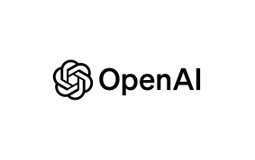

<!-- height or width of logo may be adjusted -->
<!-- This section is where you will replace the link to your transparent logo, the title of your project, and the very short desciptor of your project -->
<!-- If you used Canva to make your icon and don't want to pay for a background remover, you can use the website https://www.remove.bg/ to do so -->

  
  <h1 align="center">Ai Diva</h1>
  
A project for Internship in Service Learning by team Diva! 

<!-- the emojis are not set in stone! If you'd like you can remove them entirely or select your own from https://gist.github.com/rxaviers/7360908 you are welcome to -->

## :loudspeaker: About
The objective of the workshop is to teach how to use chat bots correctly, ethically, and efficiently.
<!-- You can look at other TAP projects if you need a better idea of how to describe your workshops objectives -->

This workshop has participants will learn how clear communication is key when interacting with chatbots and how unclear instructions can lead to mistakes. They will then apply these lessons in a hands-on PB&J sandwich-making activity to reinforce the concept. 

## :bulb: Project Information
<!-- 
Your Options for target audience: 
  - High School
  - College
  - Middle School
  - K-12
  - Non-Stem
  - Undergraduate
You can select from a range of audiences or a single auidience. Examples: 
    Middle School - College 
    High School - College
    K-12
  You will be presenting most often to your peers who are taking introductory technology classes, so more often than not you should be including college in your target audience range. 
-->
* <b>Difficulty Level:</b> Choose your workshop difficulty (Beginner/Intermediate/Advanced)
* <b>Target Audience:</b> K12 - College (edit .md file to view all options presented in the markdown comments)
* <b>Duration of Workshop:</b> How long your workshop takes (1 hour) 
* <b>Needed Materials:</b> Computer with keyboard
* <b>Learning Outcomes:</b> The primary goal of this project is to teach participants how by the end of this interactive experience, participants will have developed a strong understanding of how to effectively interact with AI, especially in terms of crafting clear and specific prompts.
* <b>Your Main Technology</b> Open Ai (Chat GPT API)
 

 
* [Technology Ambassador Program](https://tapggc.org/) <b>(TAP)</b> is a project-based class that provides a collaborative environment for students to work with their fellow classmates on a semester-long project using technologies of their choice. TAP strives to increase participation in IT through numerous outreach activities and workshops that are designed to showcase the creative and fun side of technology.
<!-- Commercial Video stored in the Media folder will be linked here -->

[Commercial Video](AiDivaCommercial.mp4)

<!-- videos can also be dragged and dropped into markdown files if you want them embedded -->

## :pencil2: Team: A.I. Diva

<!-- Use the team photo of your choice once youve uploaded it to the team photo folder within the media folder -->

> (From left to right: Gabe, Rebecca, My.)
<!-- replace with full names of your team members -->

* Rebecca Rahman
* Gabriel Sosa
* My Tran

## :mortar_board: Advisors
<!-- name of the two professors overseeing your TAP class -->
* Dr. Gunay
* Dr. Robertson

## :page_with_curl: Project Description
To create an interactive, engaging, and humorous chatbot experience that teaches users how to interact effectively with AI. The chatbot will have a sassy personality to keep things lighthearted while also demonstrating how important it is to communicate clearly with AI. The project will guide users through common pitfalls and challenges they may face when interacting with AI, playing a mini game as well trying to learn how to properly ask questions/prompts on figuring out the object the AI is thinking of, ultimately teaching them how to write precise and clear prompts throughout the whole workshop.

Artificial Intelligence (AI) is rapidly transforming various industries, but its responsible use remains a key challenge. Our project, A.I. Diva, is an interactive, sassy chatbot designed to educate users on ethical AI usage, misinformation, and appropriate AI applications in the real world. Developed as a class project under the Technology Ambassador Program (TAP), A.I. Diva provides engaging, scenario-based learning experiences that teach users how to critically evaluate AI-generated content and design optimal prompts. Through hands-on workshops, we engage participants in real-world AI dilemmas where they interact with A.I. Diva, receive instant feedback, and refine their understanding of AI best practices. Preliminary results indicate a significant improvement in participants’ ability to identify AI-generated misinformation, understand ethical AI principles, and develop stronger AI literacy skills. Survey data and graphical analyses highlight measurable growth in participants’ critical thinking regarding AI interactions. As AI literacy becomes increasingly essential, A.I. Diva bridges the knowledge gap by making AI education engaging and accessible. With plans to expand this initiative through TAP’s outreach programs and educational collaborations, our chatbot serves as a stepping stone toward responsible AI adoption in academic and professional settings. 

## :memo: Publications
<!-- team members, then professors/advisors. "Name of Publication", event, month and day, year, Georgia Gwinnett College. -->
1. Gabriel Sosa, My Tran, Rebecca Rahman, Cengiz Gunay, Cindy Robertson. February 1, 2025, Georgia Gwinnett College.  

## :open_hands: Outreach

1. <b>TAP Expo</b>, April 1, 2021, Georgia Gwinnett College: to promote the IT field and encourage college students to sign up for TAP.
2. <b>Class Workshops</b>, March 20, 2025, March 31, 2025, April 1, 2025, & April 4 2025, Georgia Gwinnett College: to promote the IT field to bot IT students and non-IT students.
3. <b>GGC Atlanta Science Festival/Piedmont Park<b>, March 15, 2025 & March 22, 2025, Georgia Gwinnett College: to promote the IT field to non-IT students and to other STEM students.

## :mag_right: Similar Projects
Some Sister Projects in regards to AI projects in TAP is the Artify project Example: </i> Artify

## :computer: Technology
<i> Open A.I. </i>
<!-- be sure to use the alt text feature in case anybody viewing your repo is using  screen reader! you want your workshop to be as accessible as possible -->

  

* OpenAI is a company that researches and develops artificial intelligence (AI) with the goal of making it benefit all of humanity. OpenAI's research focuses on machine learning, deep learning, and reinforcement learning. OpenAI conducts research into the boundaries of AI capabilities, including natural language processing, computer vision, and robotics. Operator is an AI agent that can perform repetitive browser tasks, such as filling out forms and ordering groceries. 

## Project Setup/Installation 
<i> This section is dedicated to linking to .md files in your documents/tutorial/ folder that will contain instructions on installation

Your repo doesn't have to have every section used below. This is just an example so you can get an idea of what your own repo should look like</i>

## CS First Installation Walkthrough
[Click here to view instructions](/documents/tutorial%20materials/CS%20FIRST/CS%20First%20Walkthrough.md)

### Getting to the game 
[Click here to view instructions](/documents/tutorial%20materials/Getting%20to%20the%20Game.md)

## Short Demo Instructions 
[Demo Video on how to install and play our game](https://youtu.be/mA80Aa55t-U)

## Workshop Instructions 
AIDivaPrompts_.pdf

[Our Game Workshop Video](https://youtu.be/Mtsre0iMStM)

Conclusion: This final section will recap the lessons learned throughout the site. Users will be encouraged to take a short quiz or challenge to test their knowledge.
Certificate: After completing the challenges and quiz, users can download a "AI DIva" certificate as a fun way to show they’ve learned the ins and outs of interacting with AI.

Workshop Completion Certificate:  https://www.canva.com/design/DAGdsilAZ8U/i2-kxl_HSPY10s8437iXSw/edit?utm_content=DAGdsilAZ8U&utm_campaign=designshare&utm_medium=link2&utm_source=sharebutton  
